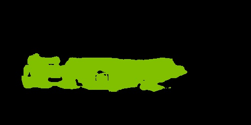

# 简介
实现fcn-8s，并再[Pascal2 VOC2012](http://host.robots.ox.ac.uk/pascal/VOC/voc2012/)数据集上训练该模型

## 主要步骤：
- [1.数据生成](#dataprocess)
- [2.代码实现](#coding)
- [3.模型训练与验证](#training)
- [4.总结](#conclusion)
</br>

## <span id="dataprocess">1.数据生成<span>
**code**：[convert_fcn_dataset.py](./convert_fcn_dataset.py)
>数据特征字典内容如下：
```python
feature_dict = {
        'image/height': dataset_util.int64_feature(height),
        'image/width': dataset_util.int64_feature(width),
        'image/filename': dataset_util.bytes_feature(data.split('/')[-1].split('.')[0].encode('utf8')),
        'image/encoded': dataset_util.bytes_feature(encoded_data),
        'image/label':  dataset_util.bytes_feature(encoded_label),
        'image/format': dataset_util.bytes_feature('jpeg'.encode('utf8')),
    }
```
</br>  

>生成tfrecord，该部分主要是需要筛选掉size小于vgg图片size
```python
def create_tf_record(output_filename, file_pars):
    writer = tf.python_io.TFRecordWriter(output_filename)
    for f in file_pars:
        tf_example = dict_to_tf_example(f[0],f[1])
        if tf_example is not None:
            writer.write(tf_example.SerializeToString())
    writer.close()
```
## <span id="coding">2.代码实现<span>
### 2.1 pydensecrf安装
```python
# clone pydensecrf
git clone https://github.com/lucasb-eyer/pydensecrf.git
# build and install pydensecrf
cd pydensecrf
python ./setup.py install
```

### 2.2 fcn-8s实现
**code**：[fcn.py](./fcn.py)
```python
#取出pool3结果，作为8s
pool3_feature = end_points['vgg_16/pool3']
with tf.variable_scope('vgg_16/fc8'):
    aux_logits_8s = slim.conv2d(pool3_feature, number_of_classes, [1, 1],
                                activation_fn=None,
                                weights_initializer=tf.zeros_initializer,
                                scope='conv_pool3')

#取出pool4结果，作为16s
pool4_feature = end_points['vgg_16/pool4']
with tf.variable_scope('vgg_16/fc8'):
    aux_logits_16s = slim.conv2d(pool4_feature, number_of_classes, [1, 1],
                                activation_fn=None,
                                weights_initializer=tf.zeros_initializer,
                                scope='conv_pool4')

# 对fc8结果做 upsampling，得到16s
upsample_filter_np_x2 = bilinear_upsample_weights(2,  # upsample_factor,
                                                number_of_classes)
upsample_filter_tensor_x2_1 = tf.Variable(upsample_filter_np_x2, name='vgg_16/fc8/t_conv_x2_1')
upsampled_logits = tf.nn.conv2d_transpose(logits, upsample_filter_tensor_x2_1,
                                        output_shape=tf.shape(aux_logits_16s),
                                        strides=[1, 2, 2, 1],
                                        padding='SAME')
# fc8做完2x upsampling之后的size与16s的相同，两个相加
upsampled_logits = upsampled_logits + aux_logits_16s
# 相加后的结果再做一次2x upsampling，得到的尺寸与8s相同
upsample_filter_tensor_x2_2 = tf.Variable(upsample_filter_np_x2, name='vgg_16/fc8/t_conv_x2_2')
upsampled_logits = tf.nn.conv2d_transpose(upsampled_logits, upsample_filter_tensor_x2_2,
                                        output_shape=tf.shape(aux_logits_8s),
                                        strides=[1, 2, 2, 1],
                                        padding='SAME')
# 新的upsampeling的结果与8s的size相同，将两者相加
upsampled_logits = upsampled_logits + aux_logits_8s

#对三个尺度相加后的结果做8x的upsampling，得到与原图尺寸相同值
upsample_filter_np_x8 = bilinear_upsample_weights(upsample_factor,
                                                number_of_classes)
upsample_filter_tensor_x8 = tf.Variable(upsample_filter_np_x8, name='vgg_16/fc8/t_conv_x8')
upsampled_logits = tf.nn.conv2d_transpose(upsampled_logits, upsample_filter_tensor_x8,
                                        output_shape=upsampled_logits_shape,
                                        strides=[1, upsample_factor, upsample_factor, 1],
                                        padding='SAME')
```

## <span id="training">3.模型训练与验证<span>
### 3.1 training process
[tran.py](./train.py)实现了模型的训练功能，基于原来的做了一些修改，将fcn和crf功能实现从原来的train.py中分离出来。  
**fcn-16s training**：
```cmd
python train.py --checkpoint_path=./vgg_16.ckpt \
--output_dir=./output_16s \
--upsample_factor=16 \
--dataset_train=./fcn_train.record \
--dataset_val=./fcn_val.record \
--batch_size=16 \
--max_steps=4000
```

**fcn-8s training**：  
修改batch size为12，max_steps增加到6000
```cmd
python train.py --checkpoint_path=./vgg_16.ckpt \
--output_dir=./output_8s \
--upsample_factor=8 \
--dataset_train=./fcn_train.record \
--dataset_val=./fcn_val.record \
--batch_size=12 \
--max_steps=6000
```
### 3.2 evaluate process
[evaluate.py](./evaluate.py)实现了验证功能，用于再validataion数据集上验证模型的结果，并计算出MIoU。
[metrics.py](./metrics.py)实现了MIoU的计算，这部分实现来源于[deeplab-v3](https://github.com/sthalles/deeplab_v3)  
变量save_samples是保存prediction和prediction_crf的jpg的样本数目  
**fcn-16s evaluate**：
```cmd
python evaluate.py --output_dir=./output_16s \
--upsample_factor=16 \
--dataset_val=./fcn_val.record \
--save_samples 20
```
Validation结果,**最终MIoU = 0.6343**：


**fcn-8s evaluate**：  
```cmd
python evaluate.py --output_dir=./output_8s \
--upsample_factor=8 \
--dataset_val=./fcn_val.record \
--save_samples 20
```
Validation结果,**最终MIoU = 0.6098**：


## <span id="conclusion">4.总结<span>
### 4.1 实现的fcn-8s比fcn-16s的MIoU要小，这个与论文中的结果不相符， 从evaluate生成的prediction的图片来看，fcn-8s生成的结果确实更精细。怀疑是MIoU的计算上有问题，但是未查到具体原因。  
### 4.2 CRF主要描述的是图像像素之间的相关程度，这很容易导致经过CRF处理后很多分类正确的像素会被剔除掉（如下图），而端到端的网络在处理这个问题上应该能得到更好的结果  
Origin:  
  
GroundTruth:  
  
预测的概率图：  
  
CRF处理后的概率图(**汽车黑色车窗部位被crf丢掉了**)：  

### 4.3 fcn-8s的train loss中包含了pool 3 layer的结果，得到的边界相比fcn-16s更平滑  
Origin:  
  
GroundTruth:  
  
fcn-8s:  
  
fcn-16s:  
  
**相对而言，fcn-8s得到的概率图在边缘部分比fcn-16s要精细更多。**  

### 4.4 fcn-8s,fcn-16s虽然比vgg 16直接出来的logits来训练要好很多，但是这些生成的不同尺度上的概率图都是经过上采样得到的，而多孔卷积更好的解决了这个问题。